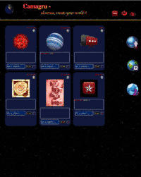

<h1 align="center">Camagru </h1>
<h2>Goal: </h2>

 Builded a web application, using only PHP, without using  any outside framework or libraries

<ul>General Instructions:</ul>
<li> Store everything in database using PDO.</li>
<li> User management: use encrypted passwords, send a verification email and check the level of   complexity of passwords.</li>
<li> Allow user to upload any type of image and be able to edit using GD library of PHP. </li>
<li> Comment, like any picture and receive a email notification about. </li>

